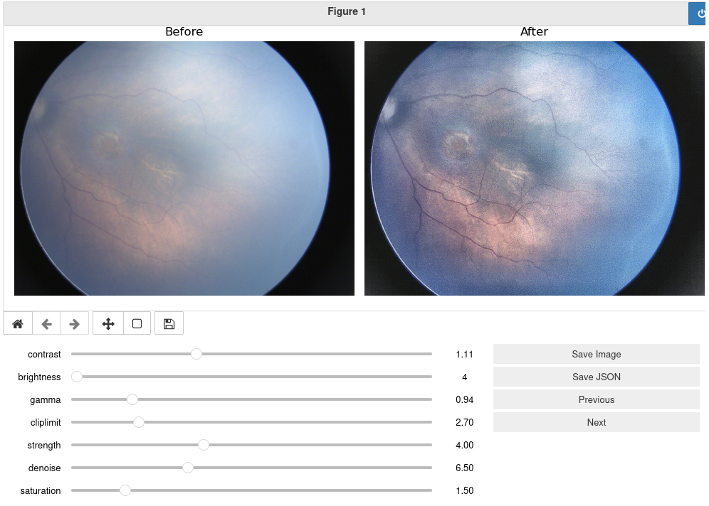

# Image Properties Editor
Simply changing properties of images on jupyter notebook
* Suitable for machine learning ground truth generation
* Quickly change contrast, brightness, gamma, and other properties of images
* Applying image enhancement functions such as cliplimit and denoise
* Easy for high number of images

## Usage
**Run the jupyter notebook**
```shell
jupyter-notebook image_properties_editor.ipynb
```
**Run each block until you reach the following block**
(image_dir should be the path to your images directory which only contains images, preferably JPEG)
```python
# Run this block for every new folder

image_dir = 'images'

image_list = os.listdir(image_dir)
image_idx = 0
json_to_write = [] # Empty the JSON buffer for new directory
output_json = image_dir + '.json'

output_dir = image_dir + '_out'
if not os.path.isdir(output_dir):
    os.mkdir(output_dir)
```
After running the next block, sliders show up and the image properties can be edited.
Save each image after change. Saving JSON is only necessary at the end of each directory.
## Example

